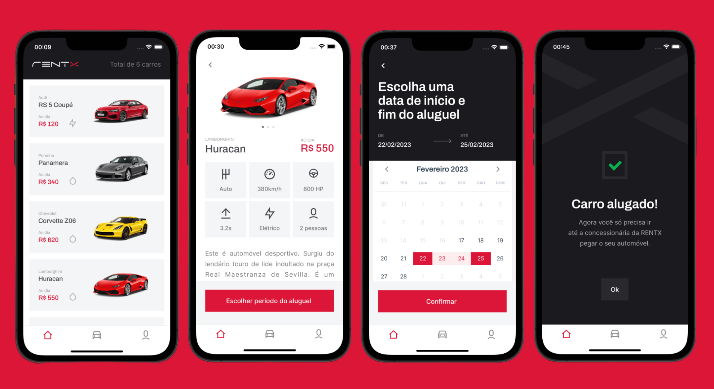
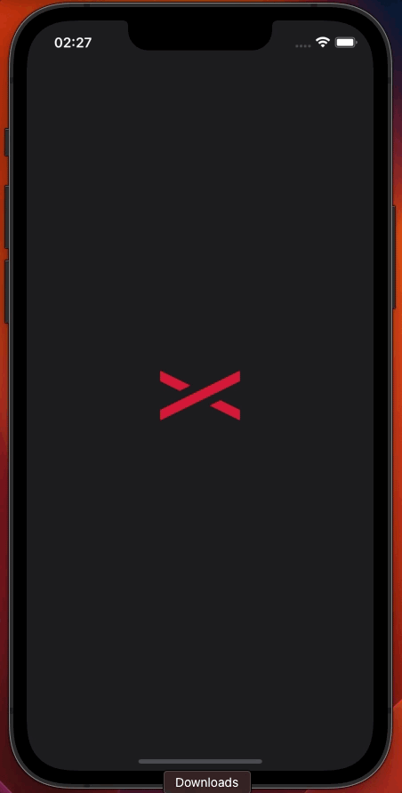
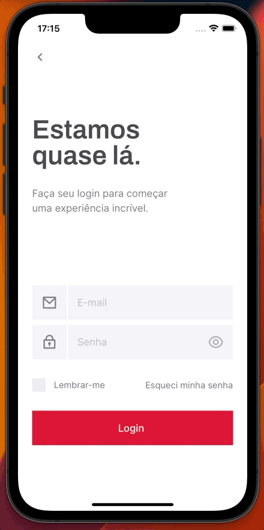
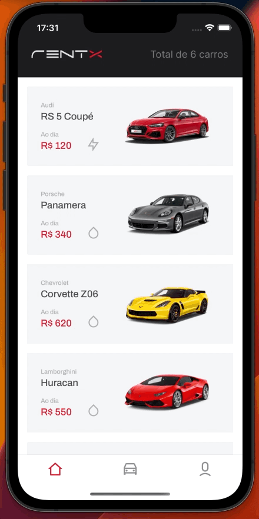

# RentX 🚗
Um incrível aplicativo de aluguel de carros de luxo. 

O projeto é resultado de um desafio de desenvolvimento mobile proposto pela [Rocketseat](https://github.com/Rocketseat), foi produzido utilizando conceitos avançados de React Native.

<a href="https://www.figma.com/file/ruqh1i9cJRW8VdQXTatOxg/RentX-V1">

</a>

# 📱 Preview


|                               SplashScreen / Onboard                       |                               Criar usuário                                    |                               Autenticação de usuário / Home                  | 
| :------------------------------------------------------------------------: | :----------------------------------------------------------------------------: | :----------------------------------------------------------------------------:| 
|                |           |            |

|                               Alugar carro                                 |                               Agendamentos                                     |                               Perfil / Editar perfil                          | 
| :------------------------------------------------------------------------: | :----------------------------------------------------------------------------: | :----------------------------------------------------------------------------:| 
|           |             |              |


## 🛠️ Stack
Nesta aplicação utilizei de forma inteligente e dinâmica o styled-components 
para customizar as classes de estilo, focando na reutilização do código.

Este projeto foi desenvolvido com as seguintes tecnologias:


- [React Native](https://reactnative.dev/)
- [Typescript](https://www.typescriptlang.org/)
- [Expo](https://expo.dev/)

Principais pacotes extra instalados:

- [Styled Components](https://styled-components.com/)
- [React Native Gesture Handler](https://docs.swmansion.com/react-native-gesture-handler/)
- [React Hook Form](https://react-hook-form.com/)
- [React Navigation](https://reactnavigation.org/)
- [React Native Calendars](https://github.com/wix/react-native-calendars)
- [Async Storage](https://react-native-async-storage.github.io/async-storage/)
- [Flash Message](https://www.npmjs.com/package/react-native-flash-message)
- [ImagePicker](https://docs.expo.dev/versions/latest/sdk/imagepicker/)
- [date-fns](https://date-fns.org/)
- [NetInfo](https://docs.expo.dev/versions/latest/sdk/netinfo/)
- [Axios](https://axios-http.com/ptbr/docs/intro)
- [Moti](https://moti.fyi/)
- [Yup](https://www.npmjs.com/package/yup)

## ⚙️ Features

* Autenticação de usuário
* Criar novo usuário
* Atualização de perfil
* Listar meus carros de aluguel
* Listar carros disponíveis
* Alugar carros
* Offline First para listagem de carros e perfil
* E mais...

## [](https://github.com/eliaslma/rentx-app) 🚀 Como executar o projeto

### Pré-requisitos

Antes de começar, você vai precisar ter instalado em sua máquina as seguintes ferramentas:

[Git](https://git-scm.com), [Node.js](https://nodejs.org/en/) e [Expo](https://expo.dev).

Além disto é bom ter um editor para trabalhar com o código como [VSCode](https://code.visualstudio.com/).

### ⚠️ É necessário iniciar a API para testar as funcionalidades do APP

#### 🧭 1. Rodando a API

```bash

# Clone este repositório

$ git clone https://github.com/eliaslma/rentx-app.git

# Acesse a pasta do projeto no seu terminal/cmd

$ cd rentx-app/api/

# Instale as dependências

$ npm install

# ou

$ yarn

# Execute a aplicação

$ yarn start

```

#### 🧭 2. Rodando o APP

```bash

# Acesse a pasta do projeto no seu terminal/cmd

$ cd rentx-app/mobile/

# Instale as dependências

$ npm install

# ou

$ yarn

# Execute a aplicação

$ expo start

```

## [](https://github.com/eliaslma) 👨‍🚀 Autor


<a href="https://github.com/eliaslma">

 

 <br />

 <sub><b>Elias Lima da Silva</b></sub></a>

In ☕ We Trust!

Entre em contato:

[](https://www.linkedin.com/in/elias-lima-da-silva-a933a713a/)
[](https://api.whatsapp.com/send?phone=5544997075632&text=Olá!)
[](mailto:sci.eliaslima@gmail.com)

